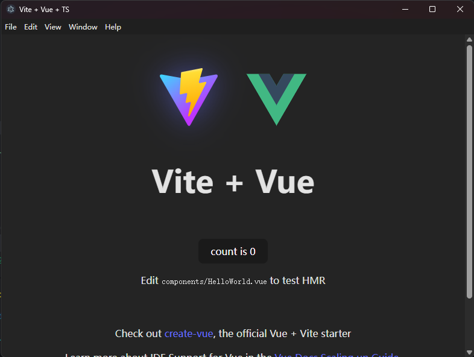

## 所用技术栈

Vue 3 + TypeScript + Vite + electron

## node

node 版本 >=20.19.0

## 项目创建

```bash
npm create vite@latest electron-vue -- --template vue-ts
```

## 安装依赖

```bash
npm install electron electron-builder --save-dev
```

## 本地运行

```bash
npm run dev
```
展示图片


## 打包

```bash
npm run build
```

## electron 打包

```bash
npm run build:electron
```

## 项目结构

```bash
electron-vue
├── build
│   ├── installer.nsh
├── publish
│   ├── vite.svg
├── src
│   ├── assets
│   ├── components
│   ├── preload.ts
│   ├── renderer
│   │   ├── App.vue
│   │   ├── main.ts
│   │   ├── style.css
│   │   └── index.html
│   └── electron
│       ├── main
│       │   ├── index.ts
│       ├── preload
│       │   ├── index.ts
